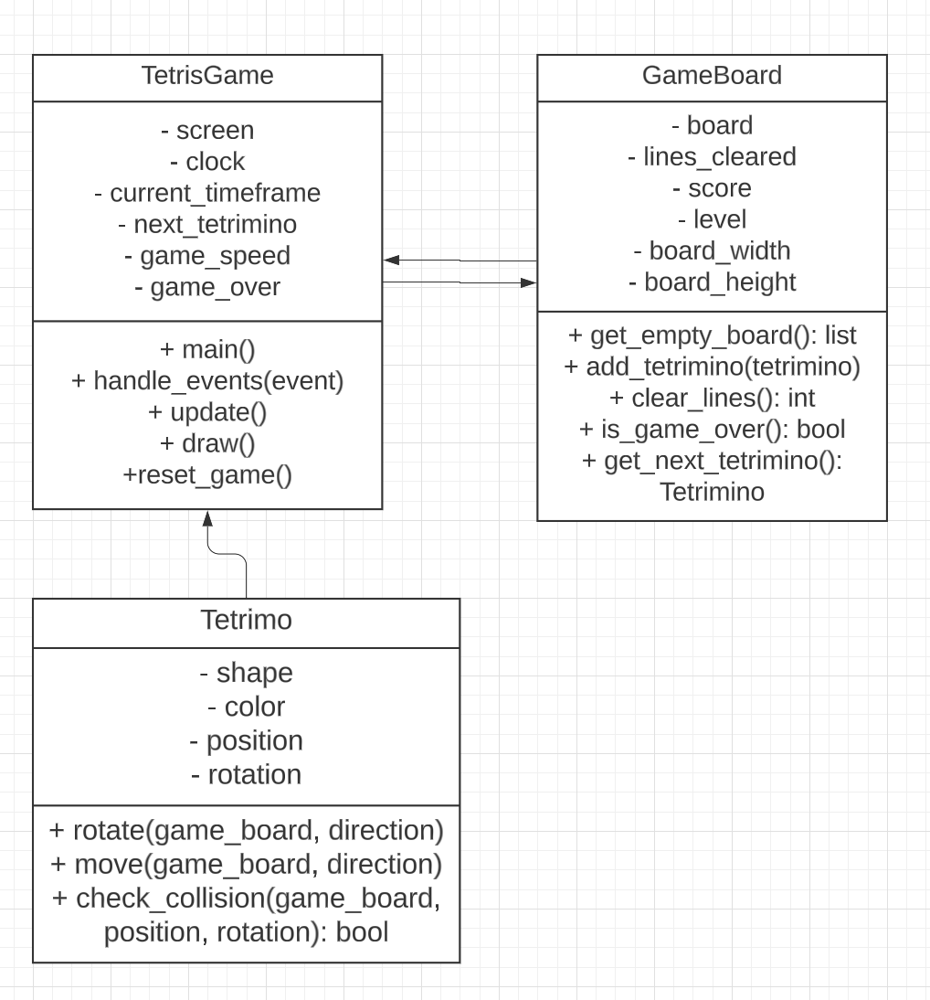

# Tetris Project in Python using Pygame

This project is designed to help you build a Tetris game in Python using the Pygame library. I'll guide you through the process step-by-step, providing explanations, a UML diagram, and code snippets to help you along the way.

## Table of Contents

- [Local Development Setup](#local-development-setup)
- [Prerequisites](#prerequisites)
- [Project Structure](#project-structure)
- [UML Diagram](#uml-diagram)
- [Getting Started](#getting-started)
- [Implementation Steps](#implementation-steps)
- [Testing and Debugging](#testing-and-debugging)
- [Packaging the Game](#packaging-the-game)

## Local Development Setup

1. To get started, you'll need to install Python 3.6 or higher on your machine. You can download the latest version of Python from the [official website](https://www.python.org/downloads/).

2. Next, you'll need to install git on your machine. You can download the latest version of git from the [official website](https://git-scm.com/downloads).

3. Clone the repository to your local machine:

```bash
git clone
```

4. Now you can open the project in your favorite IDE and start coding!

## Prerequisites

To get started, you'll need the following:

1. Python 3.6 or higher installed on your machine.
2. The Pygame library installed. You can install it using pip:

```bash
pip install pygame
```

## Project Structure

The project consists of 3 main files:

1. tetris_game.py - Main file containing the TetrisGame class responsible for running the game loop and controlling the game state.
2. game_board.py - Contains the GameBoard class responsible for managing the game board, line clears, score, and level.
3. tetrimino.py - Contains the Tetrimino class responsible for managing individual Tetrimino pieces, their shape, position, and rotation.

## UML Diagram

Here's a detailed UML diagram showing the relationships and attributes/methods of the classes:

[](uml_diagram.png)

## Getting Started

1. Create a new directory for your Tetris project and navigate to it in your terminal.
2. Create a virtual environment for your project and activate it:

```bash
python3 -m venv venv
source venv/bin/activate # Linux/Mac
venv\Scripts\activate # Windows
```

3. Install Pygame:

```bash
pip install pygame
```

## Implementation Steps

Follow these steps to implement the Tetris game:

1. Implement the Tetrimino class in tetrimino.py. Refer to the UML diagram and the starter file provided earlier for guidance.
2. Implement the GameBoard class in game_board.py. Again, refer to the UML diagram and the starter file provided earlier.
3. Implement the TetrisGame class in tetris_game.py. Use the UML diagram and the starter file as a reference.
4. Connect the classes and methods to create a functional Tetris game:

- In the TetrisGame class, instantiate the GameBoard and generate the current and next Tetriminos.
- Handle user input in the handle_events() method to control the active Tetrimino (move, rotate).
- Update the game state in the update() method (e.g., move Tetrimino down, increase level, check for line clears and game over).
- Render the game objects in the draw() method (e.g., game board, active Tetrimino, next Tetrimino, score, level).

## Testing and Debugging

As you implement the game, make sure to test each feature and fix any issues that arise:

1. Test the Tetrimino rotation, movement, and collision detection.
2. Test the GameBoard's line-clearing functionality and score calculation.
3. Test the game state updates, including level progression and game over conditions.
4. Test the game's user interface, ensuring that the game board, active Tetrimino, next Tetrimino, score, and level are displayed correctly.
5. Test the game's performance and optimize if necessary.

Remember to make use of print statements, Python's built-in debugger (pdb), and Pygame's error messages to help identify issues.

## Packaging the Game

Once you have completed the implementation and testing, you may want to package the game for distribution:

1. Install PyInstaller:

```bash
pip install pyinstaller
```

2. Package the game:

```bash
pyinstaller --onefile --windowed tetris_game.py
```

3. The packaged game will be located in the 'dist' folder within your project directory. Share the executable with your friends and let them enjoy your Tetris game!

## Conclusion

Congratulations on completing the Tetris project in Python using Pygame! You have successfully implemented a classic game and gained valuable experience in game development and object-oriented programming. Don't forget to experiment with the game's features, visuals, and mechanics to create your own unique version of Tetris.

If you encounter any issues or have questions, refer back to the UML diagram, starter files, and implementation steps for guidance. Happy coding!

This README file should provide a comprehensive guide for your friend, including the detailed UML diagram and step-by-step instructions on how to go through the project. The provided information should be helpful for a beginner programmer embarking on building a Tetris game with Python.
